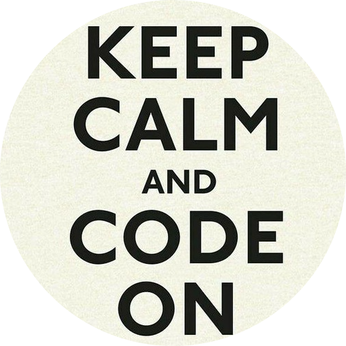
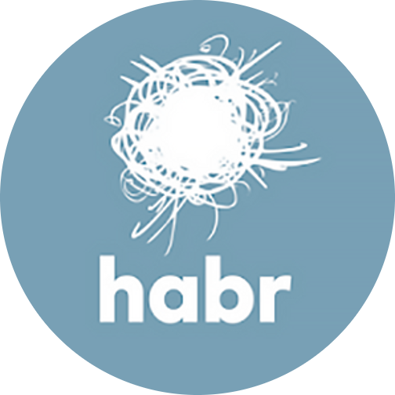

<h1 align="center">Hi there, I'm <a href="https://vk.com/tonitaga/" target="_blank">Nurislam</a>
</h1>
<h1 align="center">

---

## Contents

0. [Preamble](#preamble)
1. [About me](#about-me)
2. [Social Networking Services](#social-networking-services-clickable)
3. [Stack](#stack)
4. [Activity](#activity)
5. [Languages Stats](#languages-stats)

---

## Preamble

Somewhere near the coffee machine at the end of 2021:

*-- Hey, you really enjoy programming, have you ever thought about taking some courses?*

*- Yes, I do, but I don't even know where to learn programming.*

*-- Well, there's a programming school in our city called "School 21".*

*- Oh, right, how could I forget about that? I'll start gathering my documents and prepare for the selection process.*

*-- Good luck!*

A couple of months later:

*- Hey, I feel so scared and uncomfortable because I'm a complete beginner in programming.*

*-- Don't worry, everyone starts from scratch, we'll get through it!*

*- Today was the first day, turns out there are no teachers there, and the learning is based on a peer-to-peer system.*

*-- Wow, what's that?*

*- It means that the learning is based on the idea of mass collaboration combined with close interaction with other participants.*

After a month of diligent completion of the selection stage:

*-- I received an email today, it says that I've been accepted for the main training program.*

*- Congratulations! When does the main training start?*

*-- It starts closer to the end of April 2022.*

---

### About me

Hello everyone! My name is Nurislam Gubaydullin. I am a C++/C# developer. My journey in IT started with a project at Sberbank - School21. I specialize in algorithms and I'm an aspiring game developer, currently learning Unity Engine and Unreal Engine.

Currently, I am undergoing training at School21 for over a year. I have completed more than 15 different projects, most of which were team projects where I served as a Team Lead.

I write articles on Habr about various algorithms. You can find my profile on Habr in the Social Networking Services section. Currently, I am among the top 100 Habr accounts in Tatarstan.

I successfully passed the selection process for an internship at Ninsar.Games. My task is Gameplay development, designing game mechanics using C# and Unity. I plan to continue my game development journey, but I am also very interested in backend development.

---

### Social Networking Services [clickable]

    
    
    
    
    

---

### Stack

  &nbsp
  &nbsp
  &nbsp
  &nbsp
  &nbsp
  &nbsp
  &nbsp
  &nbsp

---

### Activity

<table>
  <tr>
    <td>
      
    </td>
  </tr>
</table>

---

### Languages Stats

<table>
  <tr>
    <td>
      
    </td>
  </tr>
</table>

---

###### Readme.md v. 1.0.4. Update from 16.10.2023
